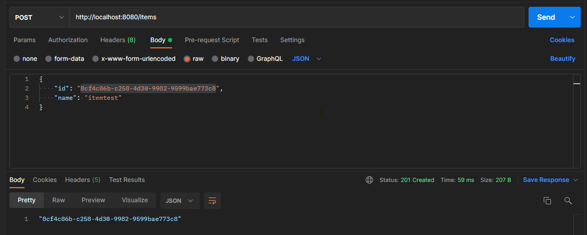
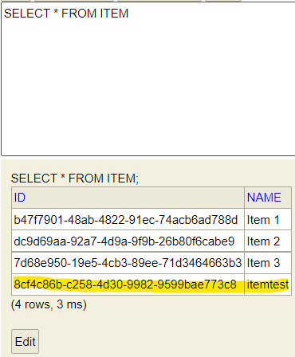
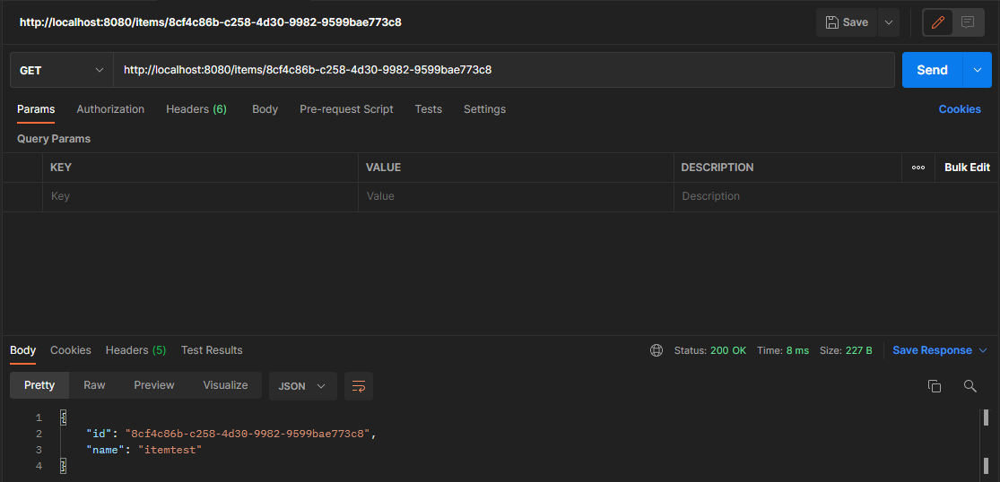

#Zadanie rekrutacyjne pierwsze

Wykorzystując JAVA napisz rozwiązanie, które przyjmie dwie metody (akcje) w API:

[POST] AddItem (ID-GUID, Name)
[GET] GetItem (ID-GUID)

Aplikacja powinna wykorzystywać wzorzec CQRS.
Aplikacja nie powinna posiadać bazy danych innej niż w pamięci.
Aplikacja powinna być skonfigurowana do osiągnięcia najwyższej wydajności pod względem obciążenia:
- CPU
- RAM

Dla realizacji projektu użyłem takie technologie: Spring Boot, Hibernate, jako bazę danych w pamięci wybrałem H2 w której
odrazu tworze 3 itema dla testów oraz Axon dla realizacji wzorca CQRS, także w projekcie zastosawałem Event Sourcing.
Pod czas napisania projektu nauczyłem się dużo nowego a konkretnie jak i jakie wzorce wykorzystują microserwisy choć 
na takim małym zadaniu.

CQRS polega na tym żeby oddzielić funkcjonalności czytania i wpisania danych. Dla tego srukturę projektu ułożyłem w 3 
pakiety: Command (który w sobie ma controllera Command, agragatora i samą komendę AddItemCommand), Query (która w sobie ma
 Query Controller, projection oraz queries) i ostatni pakiet Common który w sobie mieści to co wykorzystują i Command i Query 
(entity, repository oraz realizacje Event Sourcing)

Dla sprawdzenia sprawności projektu używałem Postman

Jeżeli chcemy dodać item to musimy w url wpisać http://localhost:8080/items a w ciałe JSON id oraz name i 
wysłąć POST Request, w odpowiedż dostaniemy numer UUID stworzonego itema i oczywiście w bazie danych zostanie wpisany nowy item

Jeżeli chcemy dostać jakiś item to musimu w url wpisać http://localhost:8080/items/{UUID} (na przykład http://localhost:8080/items/8cf4c86b-c258-4d30-9982-9599bae773c8)
wtedy dostaniemy w odpowiedż dostaniemy JSON z id i imieniem itemu

